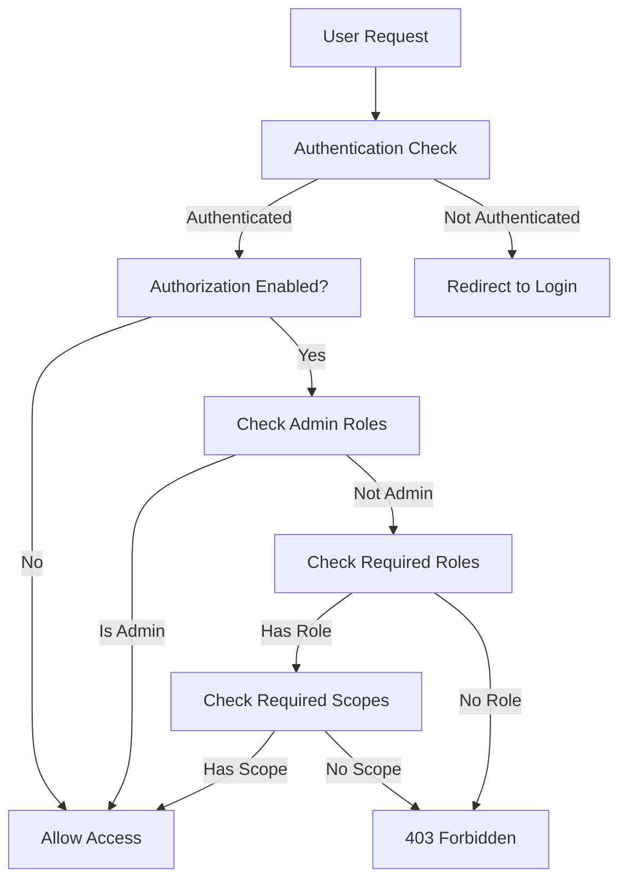

# OAuth Authorization Guide for TinyApp Gateway

This guide explains how to add role-based and scope-based authorization to your TinyApp Gateway using OAuth/OIDC.

## Overview

The TinyApp Gateway now supports **Authorization** in addition to **Authentication**:

- **Authentication**: Who you are (OIDC login)
- **Authorization**: What you can do (roles and scopes)

## Authorization Features

### 🔐 **Role-Based Access Control (RBAC)**
- Control access based on user roles (e.g., `admin`, `user`, `member`)
- Support for multiple roles per user
- Admin roles that bypass all other checks

### 🎯 **OAuth Scope-Based Access**
- Control access based on OAuth scopes (e.g., `read`, `write`, `admin`)
- Standard OAuth 2.0 scope validation
- Fine-grained permission control

### 🔄 **Flexible Claim Sources**
- Extract roles from custom JWT claims
- Support for both `roles` and `groups` claims
- Configurable claim names for different OIDC providers

## Configuration

### Environment Variables

| Variable | Default | Description |
|----------|---------|-------------|
| `AUTHZ_ENABLED` | `false` | Enable role/scope-based authorization |
| `AUTHZ_REQUIRED_ROLES` | `""` | Comma-separated required roles (ANY match) |
| `AUTHZ_REQUIRED_SCOPES` | `""` | Comma-separated required OAuth scopes (ANY match) |
| `AUTHZ_ROLE_CLAIM` | `roles` | JWT claim containing user roles |
| `AUTHZ_SCOPE_CLAIM` | `scope` | JWT claim containing OAuth scopes |
| `AUTHZ_ADMIN_ROLES` | `admin` | Admin roles that bypass all checks |

### Example Configurations

#### Basic Role-Based Access
```bash
# Only allow users with 'user' or 'member' roles
AUTHZ_ENABLED=true
AUTHZ_REQUIRED_ROLES=user,member
```

#### OAuth Scope-Based Access
```bash
# Only allow users with 'read' or 'write' scopes
AUTHZ_ENABLED=true
AUTHZ_REQUIRED_SCOPES=read,write
```

#### Combined Role and Scope Validation
```bash
# Require BOTH role AND scope
AUTHZ_ENABLED=true
AUTHZ_REQUIRED_ROLES=user,member
AUTHZ_REQUIRED_SCOPES=read
```

#### Admin Override
```bash
# Admins bypass all other checks
AUTHZ_ENABLED=true
AUTHZ_REQUIRED_ROLES=user
AUTHZ_ADMIN_ROLES=admin,superuser
```

## Testing Authorization

### 🧪 **Quick Test with Mock Provider**

```bash
cd gateway
./test-authorization.sh
```

This will:
- Start a mock OIDC provider with predefined roles and scopes
- Test user with roles: `[user, member]` and scopes: `read, write`
- Show successful authorization

### 🚫 **Test Authorization Failures**

1. **Edit configuration to require admin role:**
   ```bash
   # Edit .env.authz
   AUTHZ_REQUIRED_ROLES=admin
   ```

2. **Restart test:**
   ```bash
   ./test-authorization.sh
   ```

3. **Expected result:** 403 Forbidden (user lacks admin role)

### 📋 **Manual Testing Steps**

1. **Test without authorization (baseline):**
   ```bash
   export OIDC_ENABLED=true
   export AUTHZ_ENABLED=false
   # Should work - authentication only
   ```

2. **Test with matching roles:**
   ```bash
   export AUTHZ_ENABLED=true
   export AUTHZ_REQUIRED_ROLES=user
   # Should work - mock user has 'user' role
   ```

3. **Test with non-matching roles:**
   ```bash
   export AUTHZ_REQUIRED_ROLES=admin
   # Should fail - mock user lacks 'admin' role
   ```

## OIDC Provider Setup

### Configuring Roles in Your OIDC Provider

#### **Google Cloud Identity**
- Use Google Groups or custom claims
- Configure group membership in JWT tokens

#### **Auth0**
```javascript
// Auth0 Rule to add roles
function addRolesToToken(user, context, callback) {
  const assignedRoles = (context.authorization || {}).roles || [];
  context.idToken['roles'] = assignedRoles;
  context.accessToken['roles'] = assignedRoles;
  callback(null, user, context);
}
```

#### **Azure AD**
- Use Azure AD App Roles
- Configure role claims in token configuration

#### **Keycloak**
- Create Realm Roles or Client Roles
- Add Role Mapper to client scopes

### Example JWT Token with Roles

```json
{
  "sub": "user-123",
  "email": "user@example.com",
  "roles": ["user", "member"],
  "groups": ["developers", "testers"],
  "scope": "openid profile email read write",
  "iss": "https://your-provider.com",
  "exp": 1234567890
}
```

## Authorization Flow



## Common Use Cases

### 🏢 **Enterprise Application**
```bash
# Different access levels
AUTHZ_ENABLED=true
AUTHZ_REQUIRED_ROLES=employee,contractor
AUTHZ_ADMIN_ROLES=admin,manager
```

### 📊 **API Gateway**
```bash
# Scope-based API access
AUTHZ_ENABLED=true
AUTHZ_REQUIRED_SCOPES=api:read,api:write
```

### 🔒 **Multi-Tenant Application**
```bash
# Tenant-specific roles
AUTHZ_ENABLED=true
AUTHZ_REQUIRED_ROLES=tenant-a-user,tenant-b-user
AUTHZ_ROLE_CLAIM=tenant_roles
```

## Troubleshooting

### Common Issues

1. **"Access denied: user lacks required roles"**
   - Check JWT token contains expected roles in the configured claim
   - Verify `AUTHZ_ROLE_CLAIM` matches your token structure
   - Enable debug logging: `LOG_LEVEL=debug`

2. **"Access denied: user lacks required scopes"** 
   - Check OAuth scopes in token match required scopes
   - Verify `AUTHZ_SCOPE_CLAIM` configuration
   - Check scope format (space-separated vs array)

3. **Authorization bypassed unexpectedly**
   - Check if user has admin roles defined in `AUTHZ_ADMIN_ROLES`
   - Verify `AUTHZ_ENABLED=true`

### Debug Mode

Enable detailed authorization logging:

```bash
export LOG_LEVEL=debug
```

Look for log messages like:
```
user has admin role, bypassing authorization checks
authorization check passed
user lacks required roles
```

### Token Inspection

Check JWT tokens at [jwt.io](https://jwt.io) to verify claims structure.

## Migration from Authentication-Only

### Step 1: Enable Authorization (Allow All)
```bash
AUTHZ_ENABLED=true
# Don't set AUTHZ_REQUIRED_ROLES or AUTHZ_REQUIRED_SCOPES
# This enables authorization but allows all authenticated users
```

### Step 2: Add Role Requirements Gradually
```bash
AUTHZ_REQUIRED_ROLES=user  # Start with broad role
```

### Step 3: Refine Access Control
```bash
AUTHZ_REQUIRED_ROLES=premium-user,admin
AUTHZ_REQUIRED_SCOPES=read
```

## Best Practices

### 🔐 **Security**
- Use principle of least privilege
- Define clear role hierarchies
- Regularly audit role assignments
- Use short-lived tokens

### 🏗️ **Architecture**
- Start with coarse-grained roles, refine over time
- Use scopes for API-level permissions
- Use roles for application-level permissions
- Consider using groups as roles for easier management

### 🧪 **Testing**
- Test both positive and negative authorization cases
- Verify admin override functionality
- Test with expired tokens
- Validate error messages don't leak sensitive information